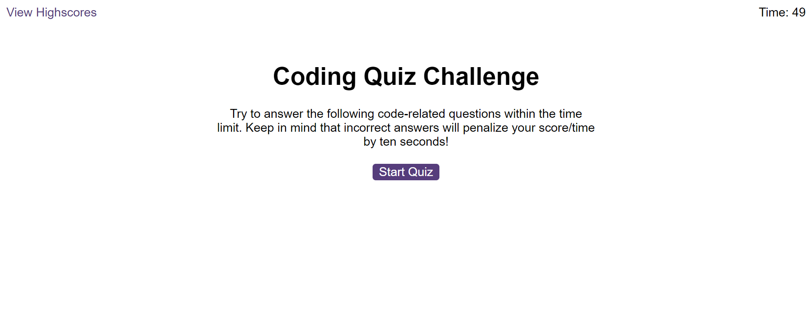
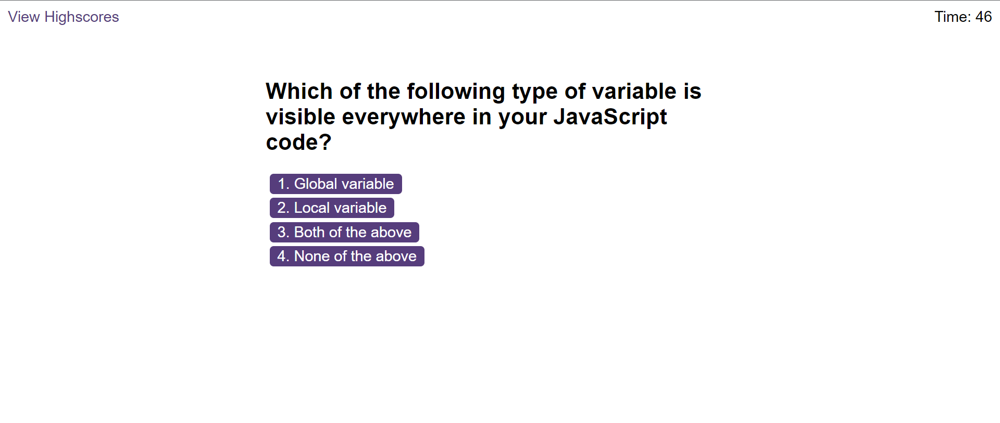
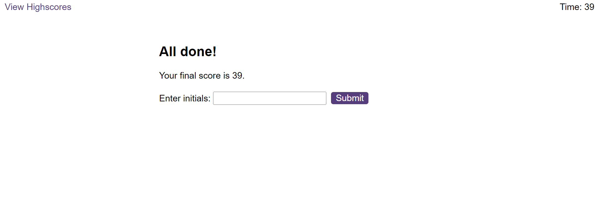
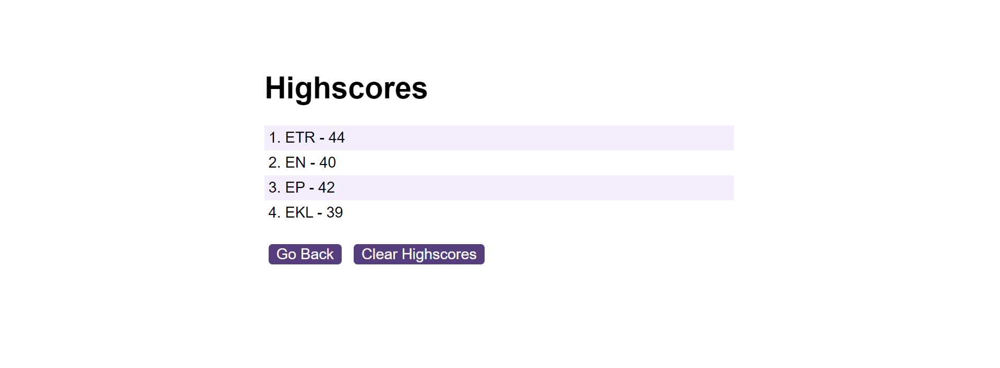

# JavaScript-Fundamentals-Quiz

The app represents a timed coding quiz with multiple-choice questions that stores high scores.

## Deployed Website

- Check out the live demo [Quiz-JavaScript-Fundamentals](https://elentis.github.io/JavaScript-Fundamentals-Quiz/index.html)

## Contents

- [Description](#description)
- [Screenshots](#screenshots)
- [Authors](#authors)
- [Skills](#skills)
- [License](#license)

## Description

- The app runs in the browser, and feature dynamically updated HTML and CSS powered by JavaScript code.
- When the start button is clicked, the first question is presented to the user and the timer starts.
- After the question is answered, the next question is presented.
- For every answer, feedback is given (correct/wrong) which is accompanied with an appropriate sound effect.
- When the answer is incorrect, the time is substracted from the clock.
- When all the questions are answered or the timer resches 0, the game is over.
- After the game is over, the user can save their initials and their score.
- The user has the option to clear the saved scores by pushing the clear scores button.

## Screenshots

## Skills

- HTML
- CSS
- JavaScript

## Authors

- [Eleftheria Elle Ntispyraki](https://github.com/EleNtis)

## License

Please refer to the LICENSE in the repo.
